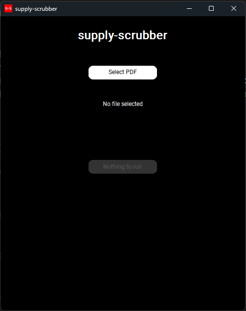
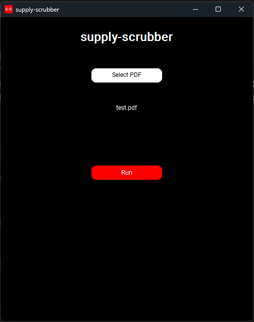
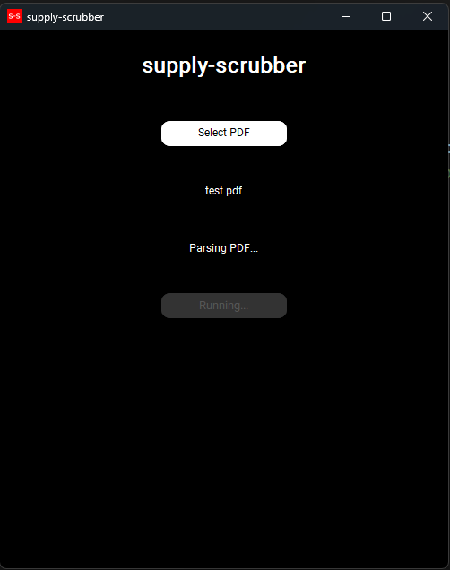
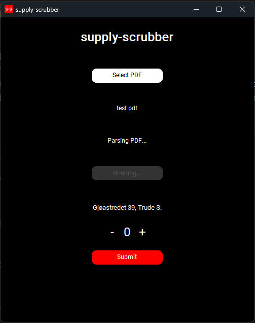
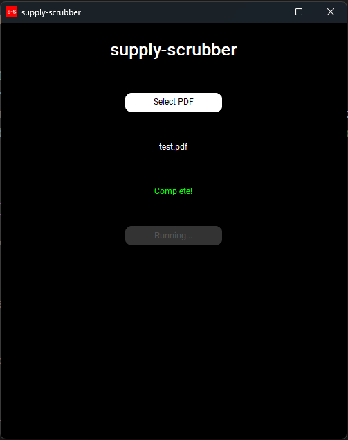
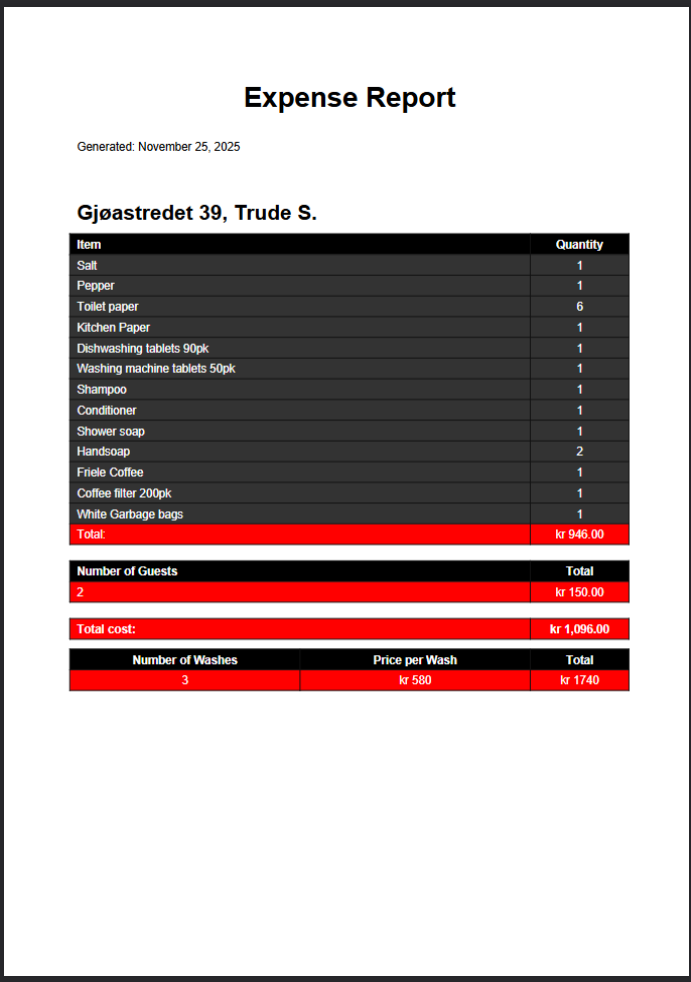

# supply-scrubber

**A desktop tool that automates monthly cost reporting for an Airbnb business by parsing custom cleaning-company PDF invoices and generating structured, accountant-ready PDF overviews.**

## Features
- Parses PDF invoices using **pdfplumber** + **regex**
- Extracts per-apartment restocking quantities, guest counts, and dates
- Combines data with:
  - Per-apartment number of cleanings entered by the user
  - Per-apartment price lists (cleaning fees + individual supply items)
- Calculates exact costs per stay and per month
- Saves structured overviews as JSON (`washes.json`, `apartments.json`)
- Generates a clean, multi-page PDF report (one page per apartment) ready for the accountant

## Screenshots

  
  

  
  

  
  

## Get started

1. Clone the repository:
    git clone https://github.com/magnusapaulsen/supply-scrubber.git
    cd supply-scrubber

2. Install dependencies:
    pip install -r requirements.txt (pip3 install -r)
    *Note:* Ensure you have Python 3.8+ installed.

3. Get price lists:
    Place your JSON price lists (`price_list_items.json` & `price_list_apartments`) inside the data folder of the project directory.
    (Example files are included)

4. Run the script:
    python main.py (python3 main.py)

5. Navigate the GUI:
    Select PDF.
    Run parsing.
    Fill in number of cleanings.

6. Run the PDF generator:
    python pdf_generator.py (python3 pdf_generator.py)

## Requirements
- `CTkSpinbox`
- `customtkinter`
- `pdfplumber`
- `reportlab`

List of dependencies is in `requirements.txt`.